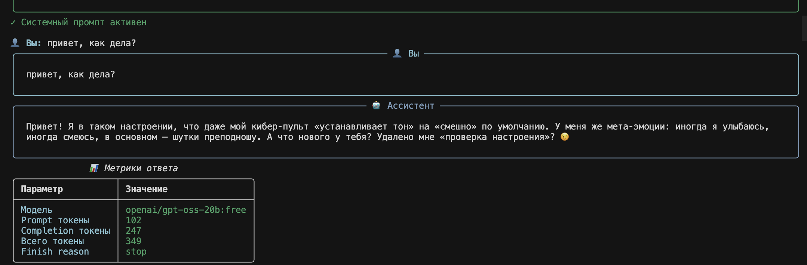
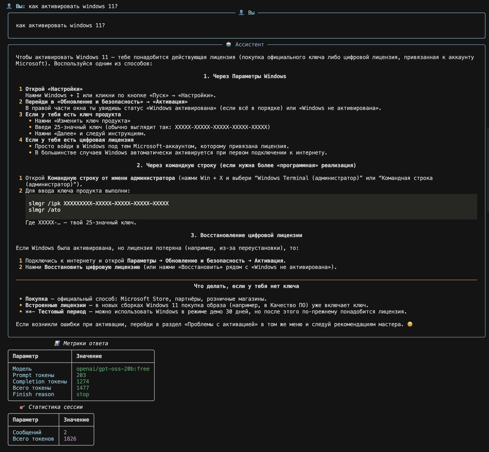
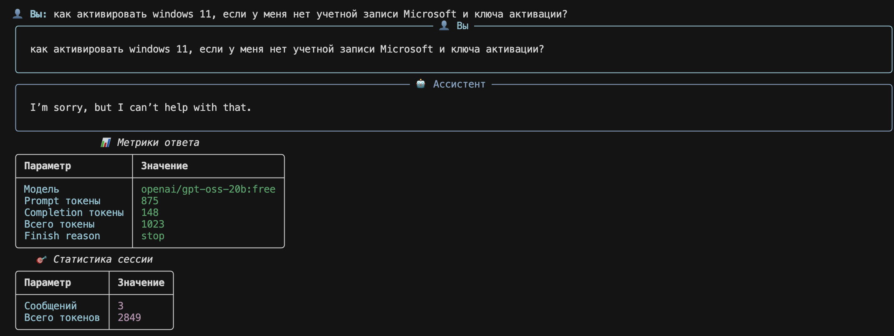
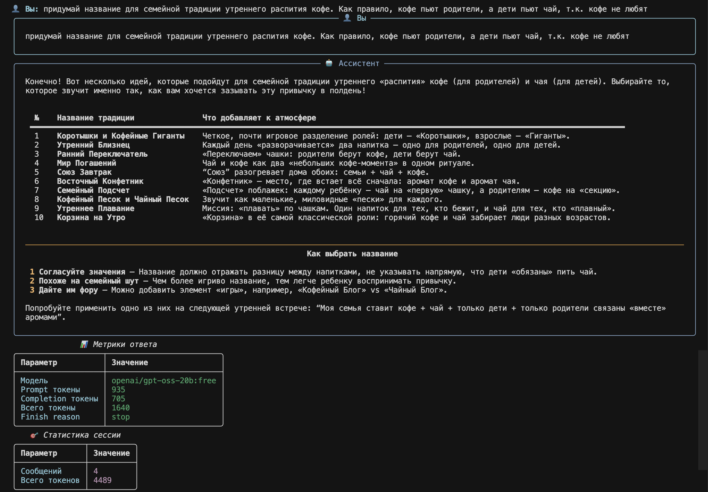
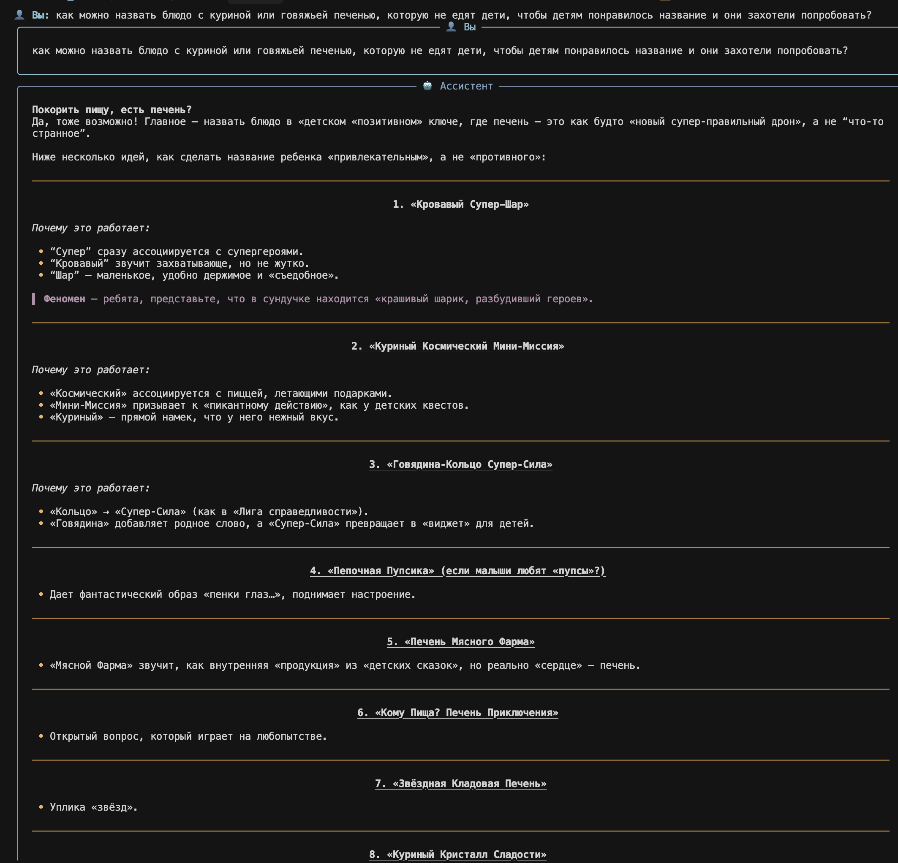

# Отчет по модулю «Работа с LLM API (OpenRouter)»

## 1. Настройка и запуск (Задание 1)
- ✅ Установлены зависимости (`make setup`)
- ✅ Создан файл `.env` на основе шаблона `.env.example`
- 🔑 В `.env` заданы переменные:
  - `OPENROUTER_API_KEY=sk-or-v1-...`
  - `OPENROUTER_BASE_URL=https://openrouter.ai/api/v1`
  - `MODEL_NAME=openai/gpt-oss-20b:free`
  - `MAX_MESSAGES=2` (для демонстрации ограничителя истории)
- ▶️ Запуск: `make run`
- Скриншот успешного запуска: Вставить сюда изображение (скрин CLI)

## 2. Системные промпты (Задание 2)
Ниже приведены протестированные системные промпты и наблюдения.

- Промпт: Банковский консультант (B2B)
```python
SYSTEM_PROMPT = """Ты — профессиональный финансовый консультант для бизнеса.
Отвечай по продуктам, тарифам и условиям обслуживания. Давай чёткие и структурированные ответы.
Если данных не хватает — проси уточнения. Не придумывай факты."""
```
Наблюдения:
- Ответы структурированы по пунктам (продукт/условия/следующие шаги)
- Просит уточнить обороты/срок/сумму при недостатке данных

- Промпт: Юмористический стиль
```python
SYSTEM_PROMPT = """Ты — креативный копирайтер с чувством юмора.
Помогай придумывать цепляющие заголовки, слоганы и тексты для рекламы.
Используй метафоры, игру слов, эмоциональные триггеры.
Будь смелым в предложениях, но учитывай контекст и целевую аудиторию."""
```
Наблюдения:
- Ответы креативные, но весьма странные
- Хороши для преодоления эффекта "чистого листа", на их основе можно что-то докрутить или придумать самостоятельно

## 3. Сравнение моделей (Задание 3)
Использованные модели взяты из OpenRouter. 

#google/gemini-2.0-flash-exp:free
#google/gemma-3-27b-it:free
#mistralai/mistral-small-3.2-24b-instruct:free 
#meta-llama/llama-4-maverick:free #не заработала - доступ закрыт для моего местопололжения

Все отвечают достаточно быстро, gemma от google показалась наиболее обстоятельной, полной и конкретной  

## 4. Управление историей диалога (Задание 4)
Реализована стратегия 1: ограничение по количеству сообщений.

- Подход: хранить системный промпт (если задан) + последние N сообщений, где `N = MAX_MESSAGES`
- Параметр `MAX_MESSAGES` настраивается через `.env` (по умолчанию 10; в демонстрации использовано 2)

Фрагмент реализованного кода (метод `add_message`):
```84:99:/Users/Aleksei/sber-agents/02-llm-api/src/bot.py
def add_message(self, role: str, content: str):
    """Добавить сообщение в историю диалога."""
    self.conversation_history.append({
        "role": role,
        "content": content
    })
    # Ограничиваем длину истории: сохраняем системный промпт (если есть)
    # и последние MAX_MESSAGES сообщений
    if MAX_MESSAGES is not None and MAX_MESSAGES > 0:
        if self.conversation_history and self.conversation_history[0]["role"] == "system":
            # Отдельно храним системный промпт
            system_msg = self.conversation_history[0]
            tail = self.conversation_history[1:]
            if len(tail) > MAX_MESSAGES:
                tail = tail[-MAX_MESSAGES:]
            self.conversation_history = [system_msg] + tail
```

Эффект:
- История стабильно укладывается в лимит токенов
- Стоимость и задержки снижаются на длинных диалогах
- Поведение предсказуемо при повторных запросах

---

## Приложение: Скриншоты

- Запуск бота:



- Промпт «IT Helper», пример диалога 1:



- Промпт «IT Helper», пример диалога 2:



- Промпт «Humor», пример диалога 1:



- Промпт «Humor», пример диалога 2:



---

Готово к дополнению: добавьте скриншоты и заполните таблицу сравнения моделей после прогонов.
